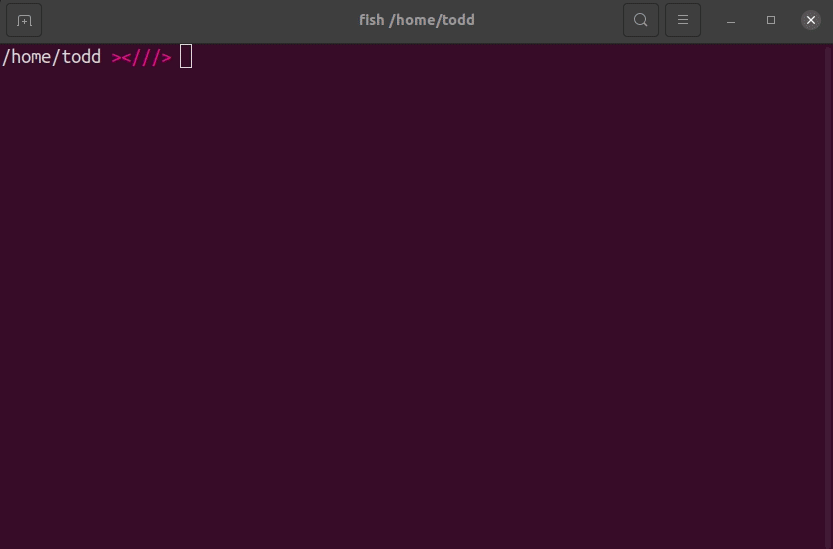

# Transform

Elixir CLI that transforms color values.

## Installation

Step 1. Clone this repo

Step 2. run `mix escript.build`

Step 3. run `./transform rgb 0,0,0`

\*recommended - `sudo mv ./transform /usr/bin/`
